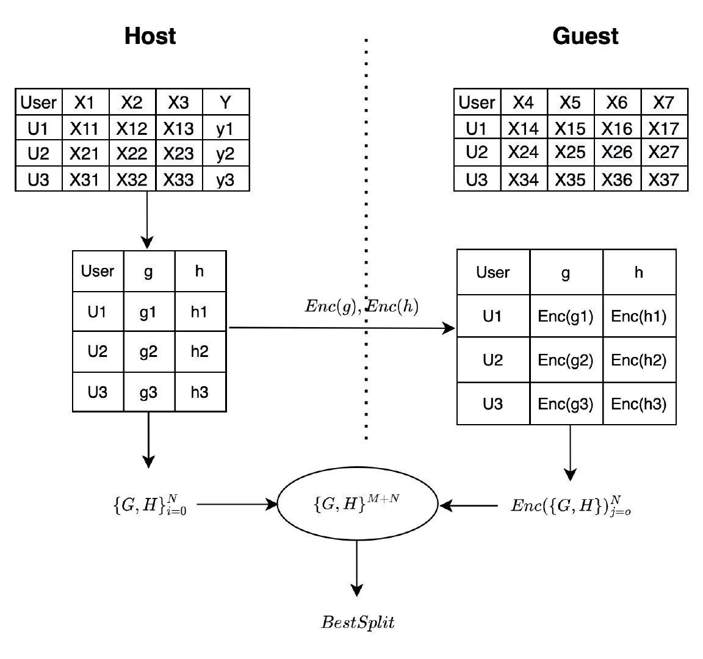
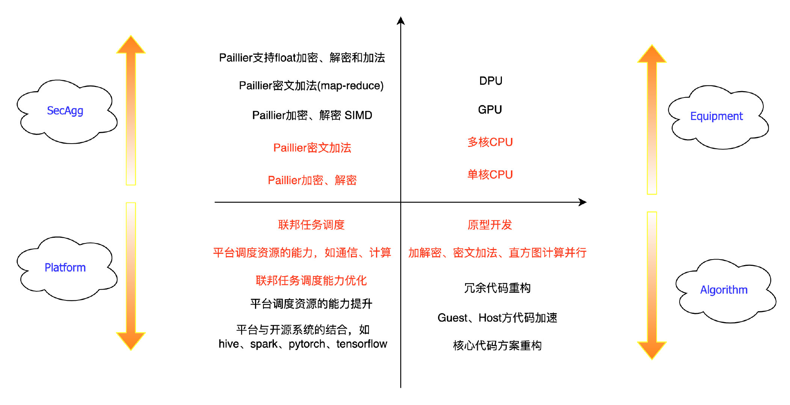

# 纵向联邦学习

## 纵向联邦学习及其应用场景

### 定义

在数据集上具有相同的样本空间、不同的特征空间的参与方所组成的联邦学习归类为纵向联邦学习（Vertical Federated Learning，VFL），也可以理解为按特征划分的联邦学习。

### 场景

作为一种保护隐私的分布式训练技术，联邦学习近几年成为学术界研究的热点话题，很多研究关于联邦学习的效率、安全性、隐私性展开讨论。最近在企业中联邦学习的应用也逐渐开展，按照参与方数据分布的差异，联邦学习通常可以分为横向联邦学习(HFL)、纵向联邦学习(VFL)以及联邦迁移学习。相较于横向联邦学习，纵向联邦学习在实际企业中应用更加广泛，它通常适用于不用部门之间数据垂直分布的场景，例如：政务开放、医疗应用、金融应用、数字广告、物流行业等。

## XGBoost原理

### 目标函数

#### 原始目标函数

原始目标函数分为两个部分：一部分是损失函数，一部分是正则（用于控制模型的复杂度）。

对于第t棵树，第i个样本，模型的预测值为:$\hat{y}_{i}^{t}=\sum_{k=1}^{t}f_{k}(x_{i})=\hat{y}_{i}^{t-1}+f_{t}(x_{i})$。

**注：其中$\hat{y}_{i}^{t}$是第t次迭代之后样本i的预测结果；$f_{t}(x_{i})$是第t棵树的模型预测结果；$\hat{y}_{i}^{t-1}$是第t-1棵树的预测结果。**

进一步可以得到原始的目标函数：$Obj=\sum_{i=1}^{n}l(y_{i},\hat{y}_{i})+\sum_{j=1}^{t}\Omega (f_{j})$

**注：其中$`l(y_{i},\hat{y}_{i})`$是模型的损失函数；$`\hat{y}_{i}`$是整个模型对第i个样本的预测值；$`y_{i}`$是第i个样本的真实值；$`\sum_{j=1}^{t}\Omega (f_{j})`$是t棵树的复杂度求和（理解为正则化项）**

#### 简化目标函数

由于XGBoost是前向迭代，可以将涉及到的前t-1个树变量或者参数看作常数，所以对目标函数进行如下简化：

$$
Obj=\sum_{i=1}^{n}l(y_{i},\hat{y}_{i}^{t})+\sum_{j=1}^{t}\Omega (f_{j})=\sum_{i=1}^{n}l(y_{i},\hat{y}_{i}^{t-1}+f_{t}(x_{i}))+\sum_{j=1}^{t}\Omega (f_{j})=\sum_{i=1}^{n}l(y_{i},\hat{y}_{i}^{t-1}+f_{t}(x_{i}))+\Omega (f_{t})+constant
$$

#### 泰勒公式对目标函数近似展开

基本泰勒公式展开如下:

$$
f(x+\Delta x)\simeq f(x)+f'(x)\Delta x+\frac{1}{2}f''(x)\Delta x^{2}
$$

将损失函数进行泰勒公式二阶展开，结果为：$l(y_{i},\hat{y}_{i}^{t-1}+f_{t}(x_{i}))\simeq l(y_{i},\hat{y}_{i}^{t-1})+g_{i}f_{t}(x_{i})+\frac{1}{2}h_{i}f_{t}^{2}(x_{i})$

**注：$g_{i}$对应的是损失函数一阶导数，$h_{i}$对应的是损失函数二阶导数**

进而可以得到目标函数展开公式如下：
$Obj\simeq \sum_{i=1}^{n}[l(y_{i},\hat{y}_{i}^{t-1})+g_{i}f_{t}(x_{i})+\frac{1}{2}h_{i}f_{t}^{2}(x_{i})]+\Omega (f_{t})+constant$

### 树的参数化

#### 树模型参数化

* 每棵树每个叶子节点的值（即每个叶子节点的权重）w
* 样本到叶子节点的映射关系（即每个样本落在当前这棵树的哪一个叶子节点上）q
* 叶子节点样本归属集合I

#### 树的复杂度参数化

* 每个树的叶子节点的个数
* 叶子节点的权重值

树的复杂度表达式如下：$\Omega(f_{t})=\gamma T+\frac{1}{2}\lambda \sum_{j=1}^{T}\omega _{j}^{2}$

**注：T为当前这棵树叶子节点的个数；$\omega _{j}^{2}$为叶子节点值的$L_{2}$范数**

## Hetero XGB

### 算法流程

Host端：数据中拥有标签的一方

Guest端：数据中没有标签的一方

1. Host端基于自研高性能Paillier库以及随机种子生成公私钥，并将公钥发送给Guest端；
2. Host端基于当前预测值和Label进行计算一阶导数与二阶导数，并将一阶与二阶导数进行半同态加密，然后发送至Guest端；
3. Host端根据己端数据，计算Host_Best_Gain，同时Guest端计算所有可能的Guest_Best_Gain，并将Guest_Best_Gain加密后发送给Host端；
4. Host端将从Guest端获取的加密Guest_Best_Gain进行解密，得到解密后的Guest_Best_Gain；
5. 在Host端比较Host_Best_Gain与Guest_Best_Gain的大小，确定XGB树的最优分裂点；
6. 重复步骤3、4、5，直到模型收敛或达到迭代最大次数，模型训练完成。

### 简化流程示意图



### Hetero_XGB算法优化



## 优化亮点

1. 基于Ray的并行加速；
2. 采用python底层的加速函数；
3. 自研高性能Pallier库；
4. 平衡Host与Guest端的计算资源，提高计算效率。

### Primihub Hetero XGB运行

:::tip
运行环境初始化，见[代码编译](../../../docs/developer-docs/build/)
:::

#### Hetero XGB Training

* 如果是通过docker-compose启动，执行 `docker exec -it node0_primihub bash` 进入到node0_primihub 容器，执行以下命令：

```Python
./primihub-cli --task_lang=python --task_code=./python/primihub/examples/disxgb_en.py --params="predictFileName:STRING:0:/data/result/prediction.csv, indicatorFileName:STRING:0:/data/result/indicator.json, hostLookupTable:STRING:0:/data/result/hostlookuptable.csv, guestLookupTable:STRING:0:/data/result/guestlookuptable.csv, modelFileName:STRING:0:/data/result/host/model"
```

* 如果是在本地编译启动，在编译完成后的代码根目录下执行以下命令：

```bash
./bazel-bin/cli --server="你的IP:50050" --task_lang=python --task_type=0 --task_code="./python/primihub/examples/disxgb_en.py" --params="predictFileName:STRING:0:/data/result/prediction.csv,indicatorFileName:STRING:0:/data/result/indicator.json,hostLookupTable:STRING:0:/data/result/hostlookuptable.csv,guestLookupTable:STRING:0:/data/result/guestlookuptable.csv,modelFileName:STRING:0:/data/result/host/model"
```

* 通过Python SDK Client启动，见[Python SDK hetero-xgb-demo](../../../docs/advance-usage/python-sdk/hetero-xgb)

#### Hetero XGB Prediction

:::tip TODO
:::

## 快速验证密文纵向XGBoost（基于Paillier）

1. 编译Paillier共享库，`bazel build --config=linux :opt_paillier_c2py_test`
2. 安装所需包 `pip3 install -r requirements.txt` ，（如果上一个应用已执行则忽略）
3. 安装 primihub 平台库， `python setup.py install --user` ，
4. 运行密文纵向XGBoost测试应用，`python python/primihub/tests/test_disxgb_en.py` 。

### 参考文献

SecureBoost: A Lossless Federated Learning Framework：<https://arxiv.org/pdf/1901.08755.pdf>

XGBoost Tutorials：<https://xgboost.readthedocs.io/en/latest/tutorials/index.html>

Federated Machine Learning: Concept and Applications：<https://arxiv.org/pdf/1902.04885.pdf>
